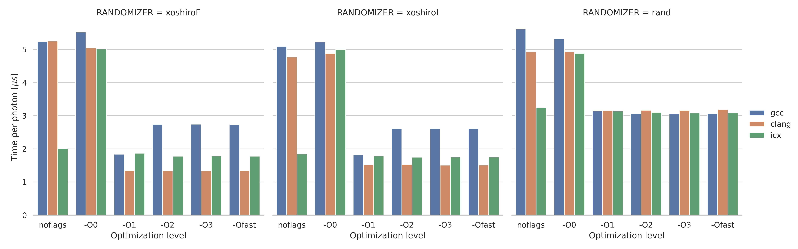
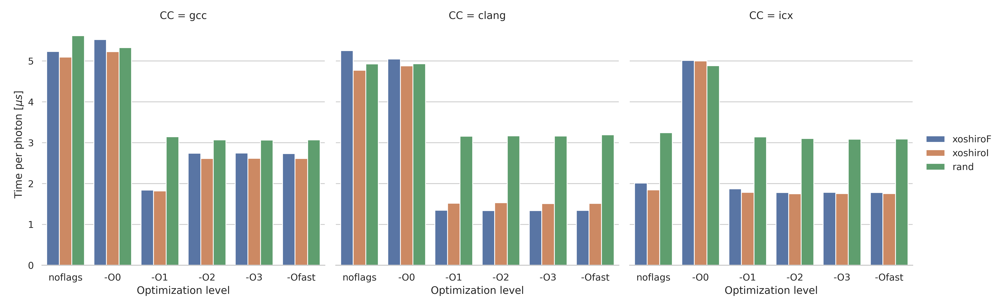
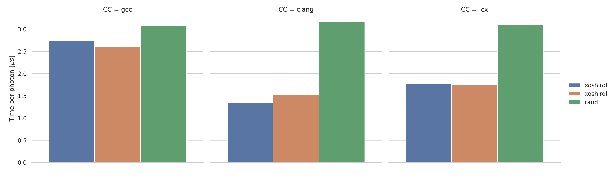

# Monte Carlo method for photon transport - Lab 1

This document

## Host Machine

| OS |
| - |
| Linux atom 6.1.0-5-amd64 #1 SMP PREEMPT_DYNAMIC Debian 6.1.12-1 (2023-02-15) x86_64 GNU/Linux |

| CPU | |
| - | - |
| Model | AMD EPYC 7643 48-Core Processor |
| Arch | x86_64 |
| L1d | 1.5 MiB (48 instances) |
| L1i | 1.5 MiB (48 instances) |
| L2 | 24 MiB (48 instances) |
| L3 | 256 MiB (8 instances) |
| Max Frequency | 3640.9170 MHz |

| CC | Linker |
| - | - |
| gcc 12.2.0 | ld 2.40 |
| clang 17.0.0 | lld 17.0.0 |
| icx 2023.0.0 | ld 2.40 |

## Metrics

All metrics related to the simulation itself are taken from the average
runtime of N photons acting on the same medium with a fixed seed value
S, the simulation has other parameters which will be specified, but the
only one that affects the final time is the seed since the exit condition
of a photon has a random factor in it.

Note that this metric is size-independant because it is an average.

## Compiler flags

The set of compiler flags used were `-O2 -DNDEBUG -march=native -ffast-math -funroll-loops`.

For *clang* we additionaly use `-flto=thin` which is exclusive to *clang*
with *lld.ld* linker enabled using `-fuse-ld=lld` at link time.

(Mostrar resultados de correr el código sin optimizaciones en todos los compiladores)

From now on every graph showcasing benchmark has all flags above enabled.

## Code Optimizations

### prng

The original code used the default C prng which has very few restrictions
concerning performance and randomness, someone initially may think that
it would probably be too fast to care, but some implementations have a few
obscure shenanigans, like [the possibility of calling malloc](https://www.thingsquare.com/blog/articles/rand-may-call-malloc/).

C's `rand()` was compared against 2 other well-known prngs: *splitmix64*
and *xoshiro*

| prng | seconds |
| - | - |
| C | 0.0782985 |
| splitmix64 | 0.0265295 |
| xoshiro256** | 0.0249912 |

For being the fastest, we chose to replace C's `rand()` with xoshiro.

After replacing `rand()` with a suitable version of xoshiro(128\*\*)
the speed of the simulation increased significantly.

(rand vs RAND_XOSHIROI)

However the reference page for xoshiro prngs suggest yet another
optimization, this time for generating numbers in [0, 1] specifically.

1. Create an IEEE-754 "float" number using the top bits of the random
number *x* as the mantissa, 0 as the sign and all 1s as the exponent, this
is done in a 32 bit integer because that level of bit manipulation cannot
be done with floats.

1. Store the result as a float, in this specific case type-casting will not
work because floats and integers are encoded differently, and type-casting
will convert between the encodings, to prevent that `memcpy()` is used to
just copying the bits without doing conversions.

1. Subtract 1 from the result because the previous steps generate a number
in [1, 2].

The final code looked like this.

```c
const uint32_t x = UINT32_C(0x7F) << 23 | (s[0] + s[3]) >> 9;

/* roll the seed */

float result;
memcpy(&result, &x, sizeof(result));

return result - 1.0;
```

And the results were the following.

(RAND_XOSHIROI vs RAND_XOSHIROF)

### fpdiv vs fpmul

It's known that floating point operations in general are slower than
integer ones, even when ignoring edge-cases with infinities and NaNs.

Although it's inevitable to avoid floating point operations, there's one
specific line of code that may produce a small slowdown.

```c
weight /= 0.1f;
```

This line of code essentially multiplies `weight` by 10, but using a
division, which tends to be slower than multiplication in most cases.

Isolating this snippet in godbolt we observed the following code being
generated.

```c
// -O3
    unpcklps    xmm0, xmm0
    cvtps2pd    xmm0, xmm0
    divsd       xmm0, QWORD PTR .LC0[rip]
    unpcklpd    xmm0, xmm0
    cvtpd2ps    xmm0, xmm0

// -O1 -ffast-math
    mulss   xmm0, DWORD PTR .LC0[rip]
```

This shows that the compiler also thinks that floating point division is
slower than multiplication but unless we use `-ffast-math` it does not
replace the division, which must have something to do with the edge cases
previously mentioned.

With that we were almost convinced that the compiler would optimize that
line for us using flags such as `-O2 -ffast-math` but it turned out it
didn't.

```
            weight /= 0.1f;
    15f8:	f3 0f 10 45 d4       	    movss  xmm0,DWORD PTR [rbp-0x2c]
    15fd:	f3 0f 10 0d 2f 0a 00 00 	movss  xmm1,DWORD PTR [rip+0xa2f]        # 2034 <_IO_stdin_used+0x34>
    1605:	f3 0f 5e c1          	 >> divss  xmm0,xmm1 << division here
    1609:	f3 0f 11 45 d4       	    movss  DWORD PTR [rbp-0x2c],xmm0
```

So the division was manually replaced that in the source code.
The results were the following.

(div vs mult)

## Putting all together

Some tests were made by running the simulation 100 times and computing the average time taken per photon and the standard deviation. In every test the compiler, their optimization flags and the randomizer were changed. The compilers used were GCC, CLANG and ICX. Their used flags were :
```
-DNDEBUG -Y -X -march=native -ffast-math -funroll-loops 
```
Were ```-X ``` stands for ```-O0```, ```-O1``` , ```-O2``` , ```-O3``` and ```-Ofast``` along with ```-Y``` which stands for the tested randomizers  ```-XOSHIROF```, ```-XOSHIROI``` and ```rand```. In addition to that, some tests were made without using compiler flags at all, that's it, the vanilla performance of the simulation.

The results are shown in the following barplots:







It's interesting to note that using the ```rand``` randomizer caps the speed of the simulation beyond ```-O0``` optimization flags, for each compiler tested. 


